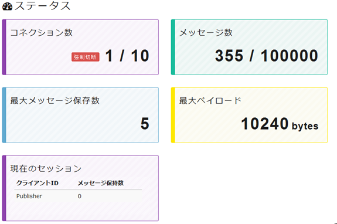

# [MQTT](https://ja.wikipedia.org/wiki/MQ_Telemetry_Transport "MQTT") for [Paho](https://eclipse.org/paho/clients/java/ "Paho") and [Sango](https://sango.shiguredo.jp/ "Sango")

Paho から MQTT ブローカーサービス（Sango Lite プラン） を利用し Pub/Sub できるところまでを確認します。  
MQTT ブローカー を自身でセットアップせずに Pub/Sub を無料で試せます(制限はあります)。

MQTT(Message Queueing Telemetry Transpor ：エムキュウティティー) については[こちら](https://sango.shiguredo.jp/mqtt "こちら")を参照してください。  
その他の情報については参考情報を合わせて確認してください。

- - -
## example
1. [Sango](https://sango.shiguredo.jp/ "Sango") ライト（Lite） プラン(無料)
に登録します。（github アカウントがあれば登録はすぐです。）
1. 当ソースをクローンまたは[ダウンロード](https://github.com/hosomi/mqtt-example/archive/master.zip "ダウンロード")します。
1. 登録した Sango ライト（Lite） プランの情報を config.yml に設定します。（Sango の [ダッシュボード](https://sango.shiguredo.jp/dashboard "ダッシュボード")に MQTT の接続情報等が記載されています。）
1. publish / subscribe の順で起動します。


### config.yaml

MQTT 接続情報の例:  
  

src/main/resources/conf/config.yaml：  
**(自身の登録情報を設定してください下記はサンプルです。)**
```yaml
broker:
  tcp: "tcp://lite.mqtt.shiguredo.jp:1883"
  username: "hosomi@github"
  password: "MQTT 接続情報のパスワードの鍵アイコンクリック後表示された値を設定"

publish:
  topic: "hosomi@github/1"
  qos: 0
  clientId: "Publisher"

subscribe:
  topic: "hosomi@github/1"
  qos: 0
  clientId: "Subscriber"
```
トピックは # の場合、前方一致になり今回の場合、正しく動作しませんので # 以外のトピックを設定してください。  
詳しくは参考情報で解説されていますので参照してください。

qos はライト（Lite） プランは 0 のみ利用できます。  

### pub/sub

プロジェクトのフォルダ直下で下記コマンドをそれぞれ実行。  

publish:
```console
gradlew -q publish
```

subscribe:  
```console
gradlew -q subscribe
```

publish は 1 回実行毎にメッセージを１回送信します。  
subscribe は 応答待ち状態で待機します。

それぞれ実行した場合はコンソールに下記が表示されれば正常に実行されています。

publish(ログ):
```console
[main] INFO mqtt.publish.MqttPublisher - Connecting to broker: tcp://lite.mqtt.shiguredo.jp:1883
[main] INFO mqtt.publish.MqttPublisher - Connected and publishing message: qos -> 0, message -> Message from Mqtt Publish Sample
[main] INFO mqtt.publish.MqttPublisher - Message published and Disconneting broker
[main] INFO mqtt.publish.MqttPublisher - Disconnected
```

subscribe(ログ):
```console
[main] INFO mqtt.subscribe.MqttSubscriber - Connecting to broker: tcp://lite.mqtt.shiguredo.jp:1883
[main] INFO mqtt.subscribe.MqttSubscriber - Connected and subscribing message: qos -> 0, topic -> hosomi@github/1（設定していたトピック名）
[main] INFO mqtt.subscribe.MqttSubscriber - Please press any key if you would disconnect to broker.
[MQTT Call: Subscriber] INFO mqtt.subscribe.MqttSubscriber - Message arrived
[MQTT Call: Subscriber] INFO mqtt.subscribe.MqttSubscriber - Topic:
[MQTT Call: Subscriber] INFO mqtt.subscribe.MqttSubscriber - Message: Message from Mqtt Publish Sample
```

pub/sub が正常に行われていれば、Sango の ダッシュボードからメッセージ数等を確認できます。  

Sango ダッシュボードのステータス:  
  

subscribe を起動せず publish を行うとメッセージがたまりますが、ライト(Lite)プランの制限は 5 メッセージしか保存できません。  


- - -
## 参考情報

* MQTT ： https://ja.wikipedia.org/wiki/MQ_Telemetry_Transport  
* Paho ： https://eclipse.org/paho/clients/java/  
* MQTT(Sango) : https://sango.shiguredo.jp/mqtt  
* Sango : https://sango.shiguredo.jp/  
* Sango プラン・料金 : https://sango.shiguredo.jp/#plan  (Lite プランの制限を確認できます。)
